.. -----------------------------------------------------------------------------
   ..
   ..  Filename       : index.rst
   ..  Author         : Huang Leilei
   ..  Status         : phase 000
   ..  Created        : 2025-09-16
   ..  Description    : description about 第00讲 - 课程简介
   ..
.. -----------------------------------------------------------------------------

第00讲 - 课程简介
--------------------------------------------------------------------------------

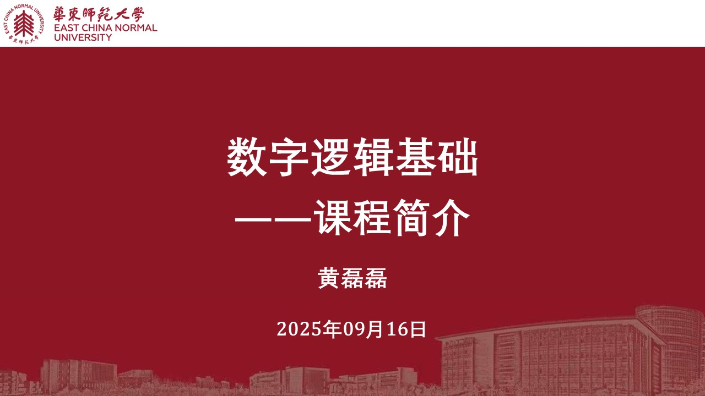

课程导入
........................................
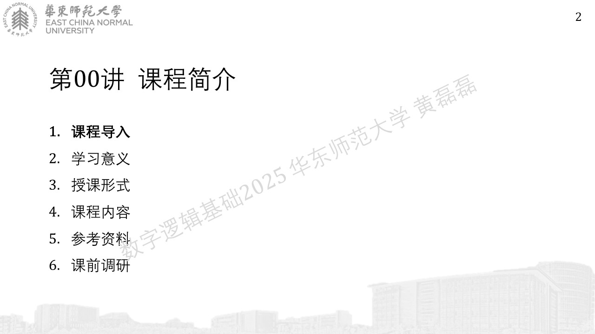
.. image:: 幻灯片3.JPG
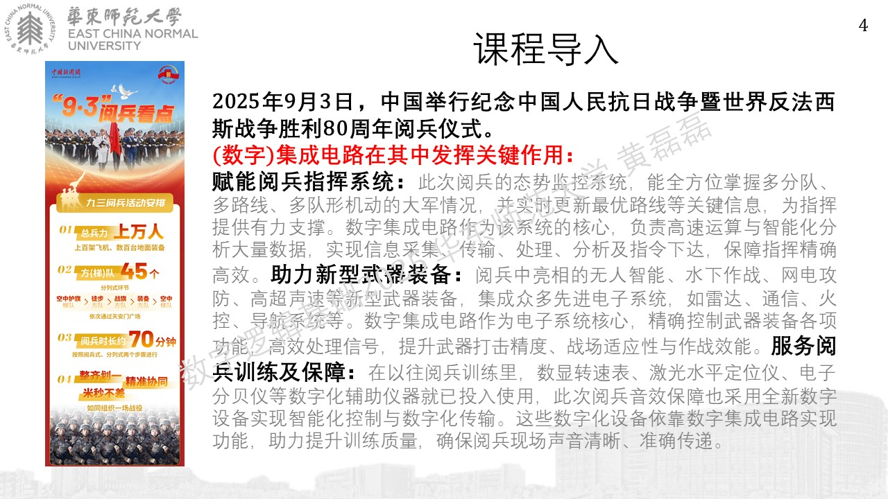
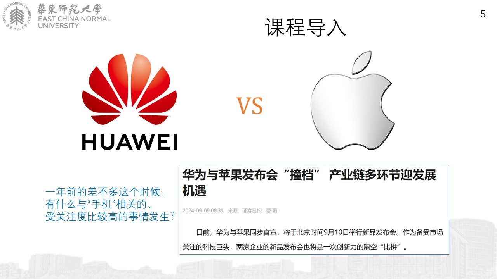
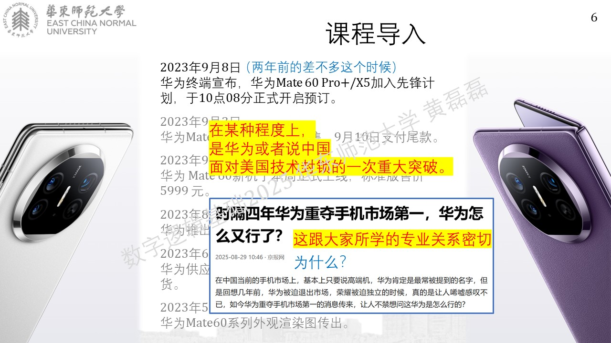
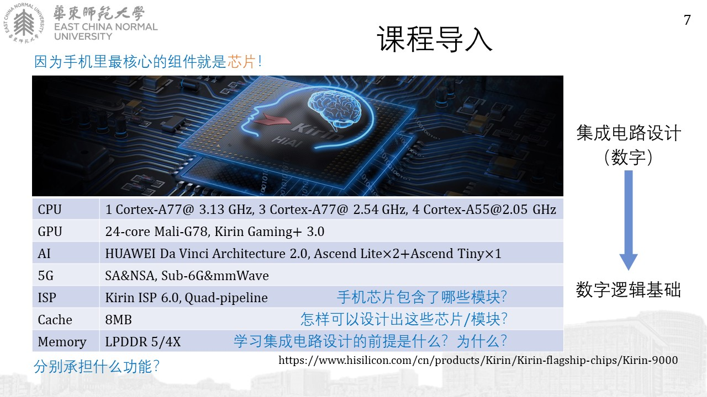

https://www.hisilicon.com/cn/products/Kirin/Kirin-flagship-chips/Kirin-9000

学习意义
........................................
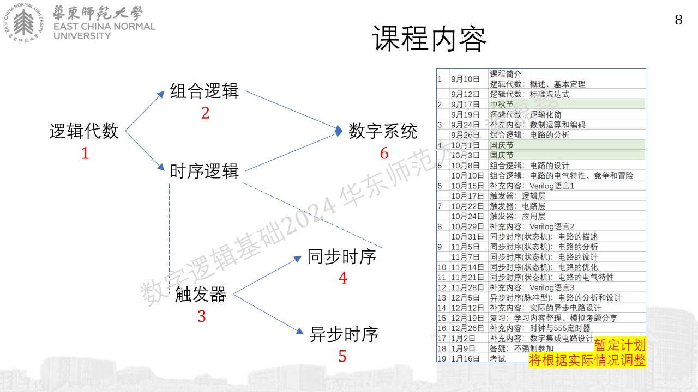

授课形式
........................................
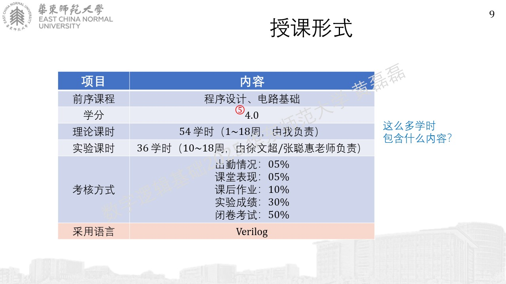

课程内容
........................................
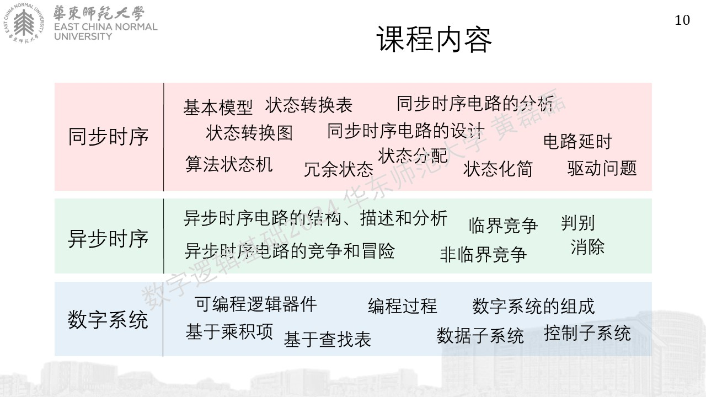
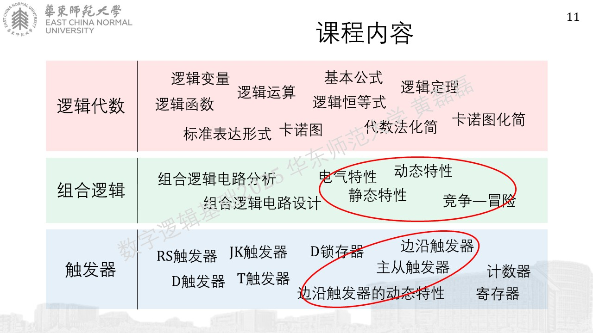
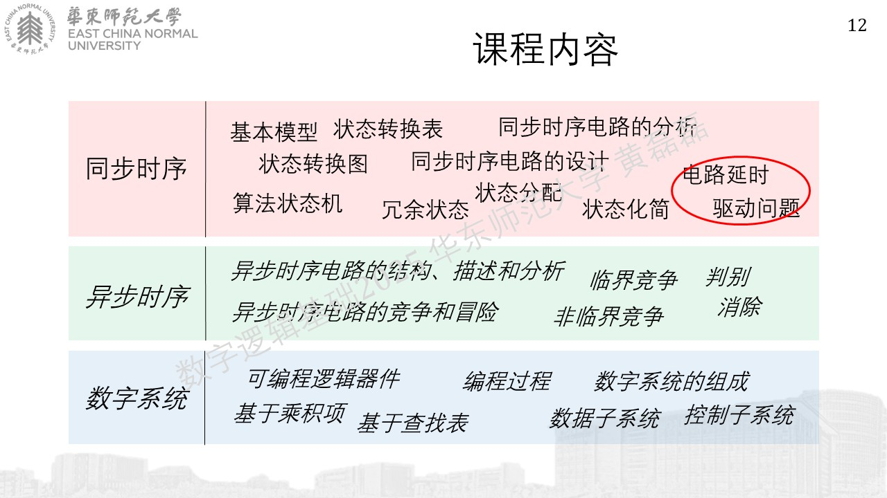

参考资料
........................................
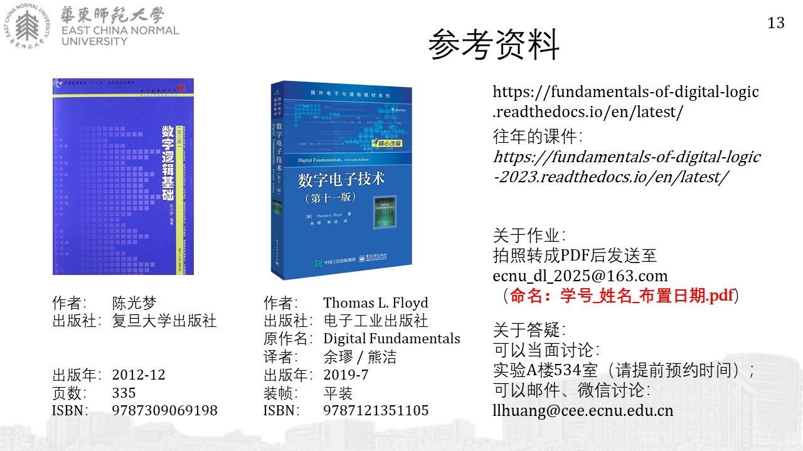

|  ecnu_dl_2025@163.com
|  llhuang@cee.ecnu.edu.cn

课前调研
........................................
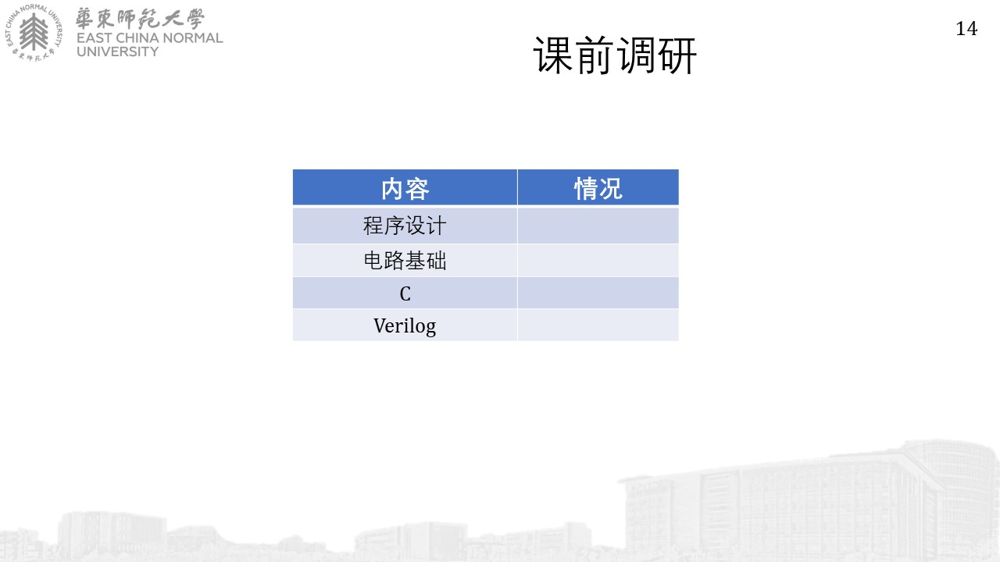
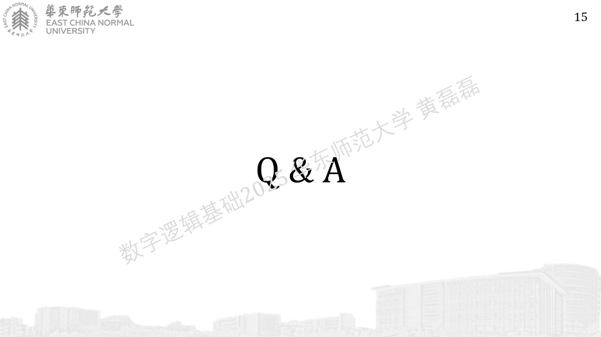
