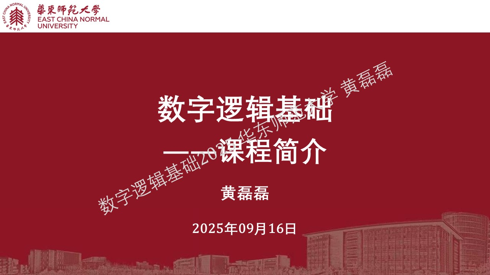
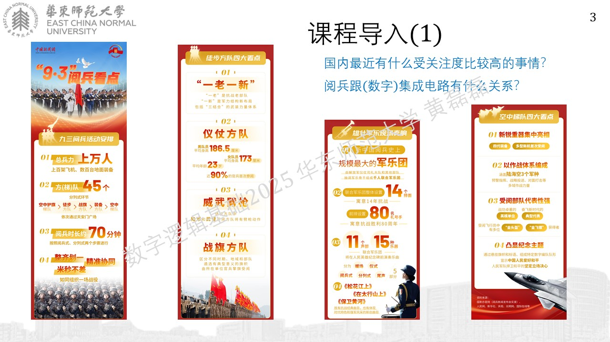
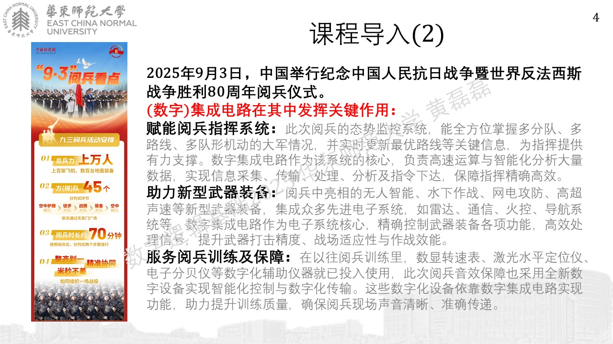
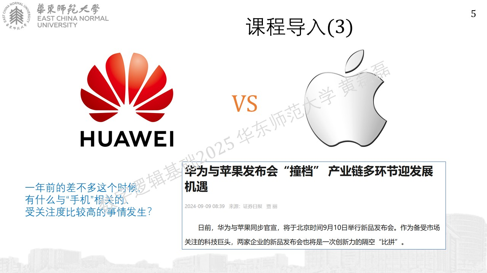
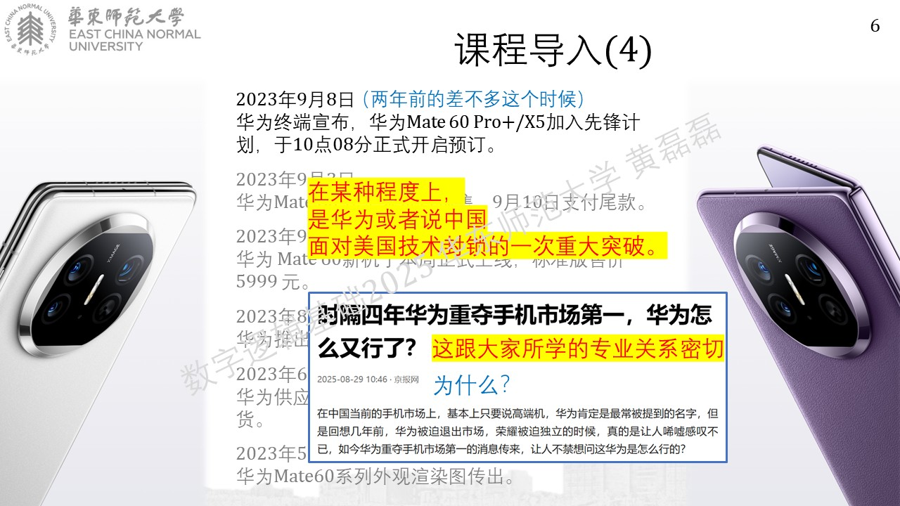
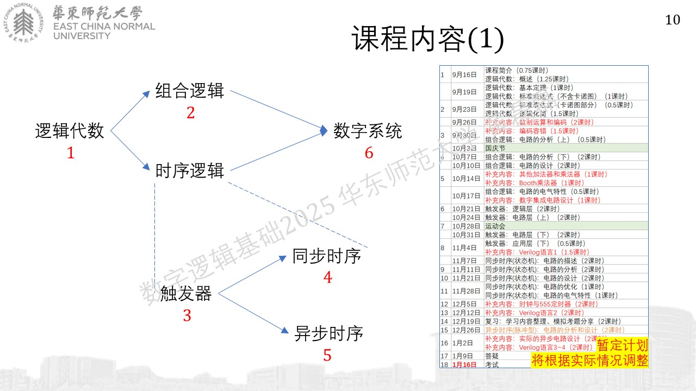
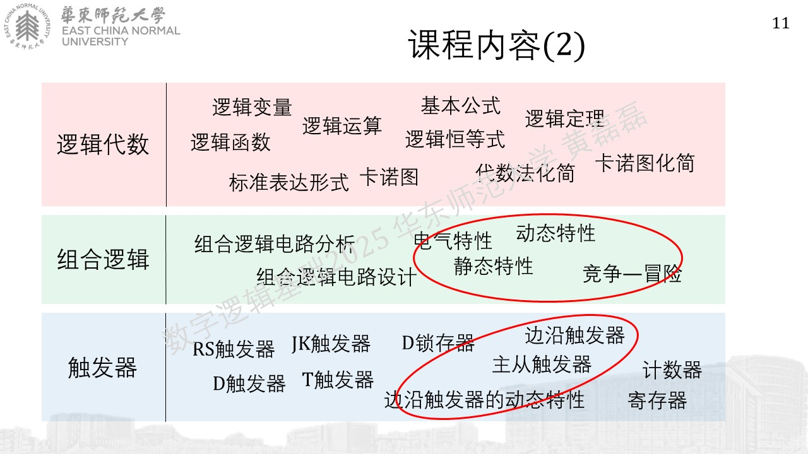
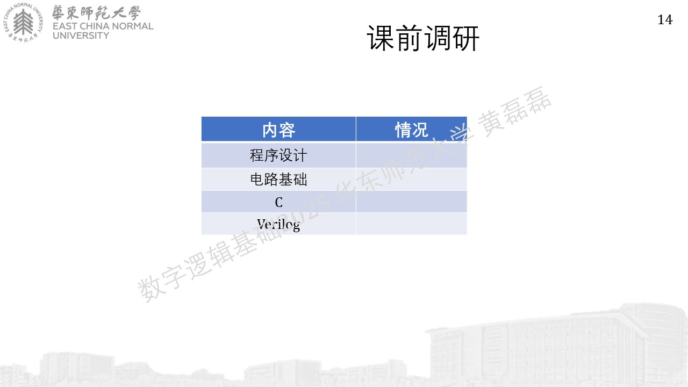

.. -----------------------------------------------------------------------------
   ..
   ..  Filename       : index.rst
   ..  Author         : Huang Leilei
   ..  Status         : phase 000
   ..  Created        : 2025-09-16
   ..  Description    : description about 第00讲 - 课程简介
   ..
.. -----------------------------------------------------------------------------

第00讲 - 课程简介
--------------------------------------------------------------------------------

课程导入
........................................

.. image:: 幻灯片7.JPG

https://www.hisilicon.com/cn/products/Kirin/Kirin-flagship-chips/Kirin-9000

学习意义
........................................
.. image:: 幻灯片8.JPG

授课形式
........................................

课程内容
........................................

.. image:: 幻灯片12.JPG

参考资料
........................................
.. image:: 幻灯片13.JPG

|  ecnu_dl_2025@163.com
|  llhuang@cee.ecnu.edu.cn

课前调研
........................................

