.. -----------------------------------------------------------------------------
   ..
   ..  Filename       : index.rst
   ..  Author         : Huang Leilei
   ..  Status         : phase 000
   ..  Created        : 2025-09-16
   ..  Description    : description about 第01讲 - 逻辑代数 - 概述
   ..
.. -----------------------------------------------------------------------------

第01讲 - 逻辑代数 - 概述
--------------------------------------------------------------------------------

逻辑关系的定义
........................................
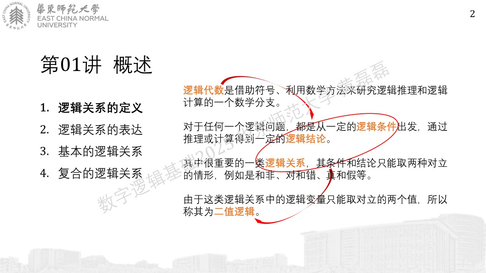
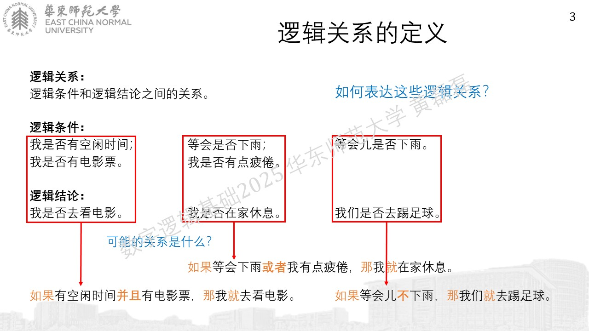

逻辑关系的表达
........................................

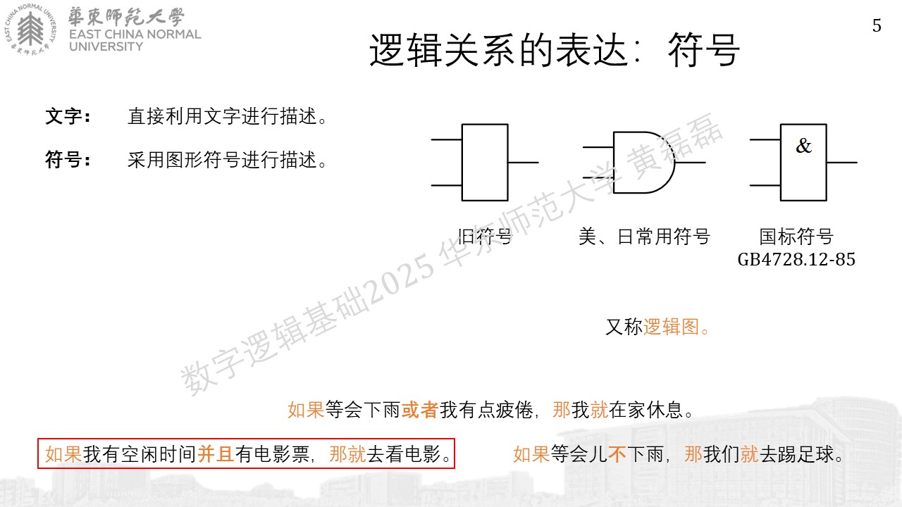
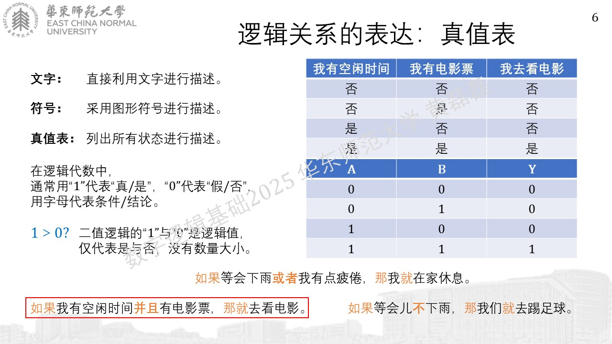
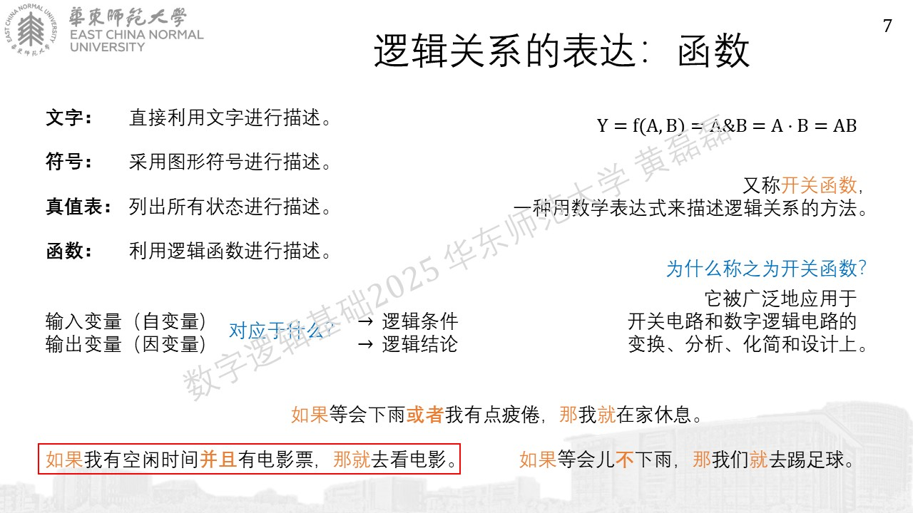

基本的逻辑关系
........................................

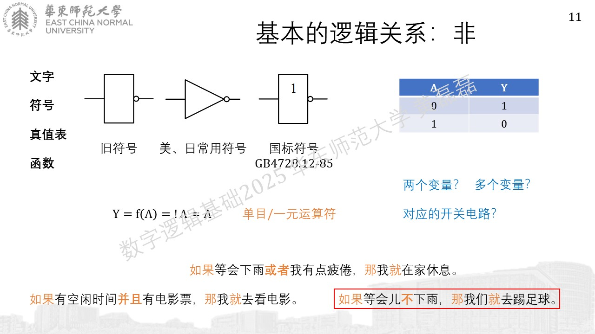

previous version

current version

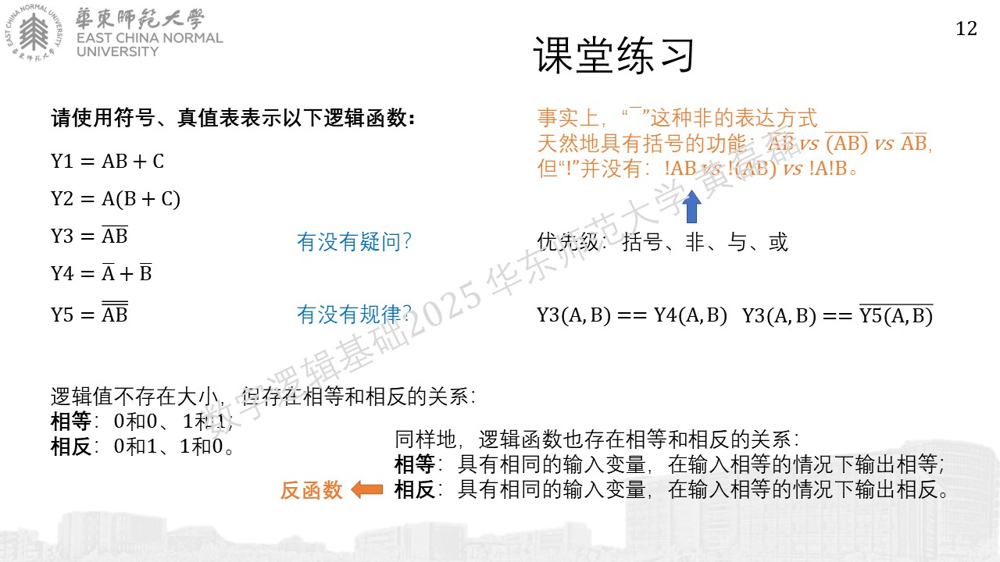

复合的逻辑关系
........................................

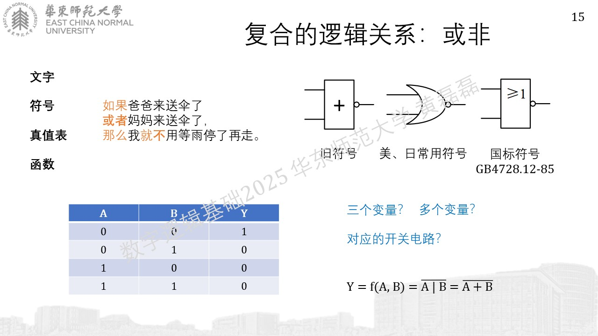
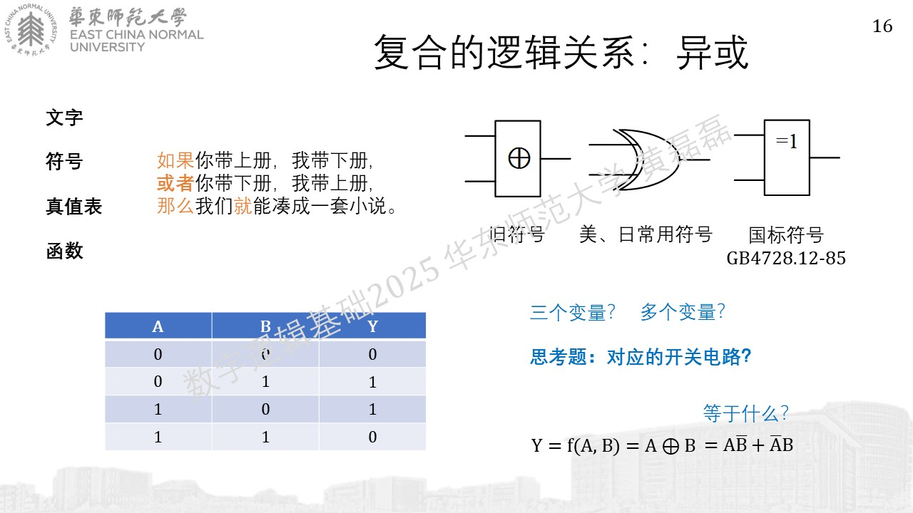

previous version

current version

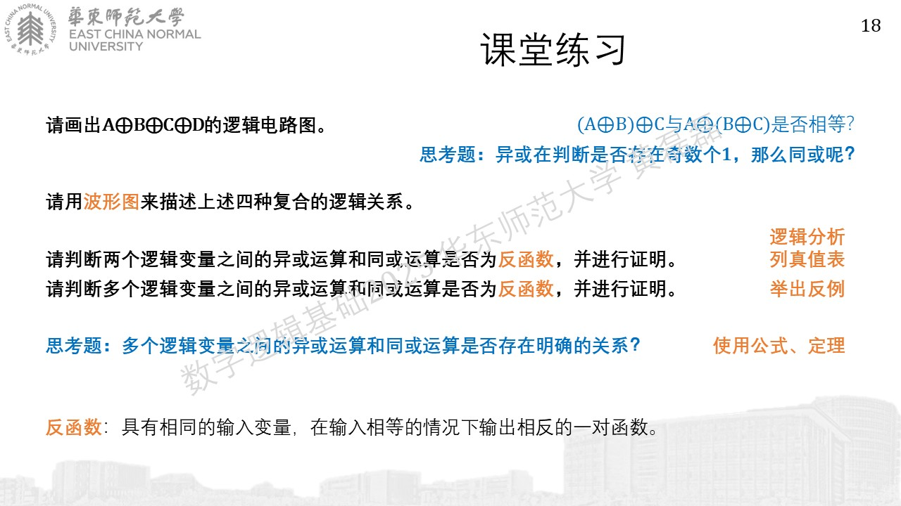

previous version

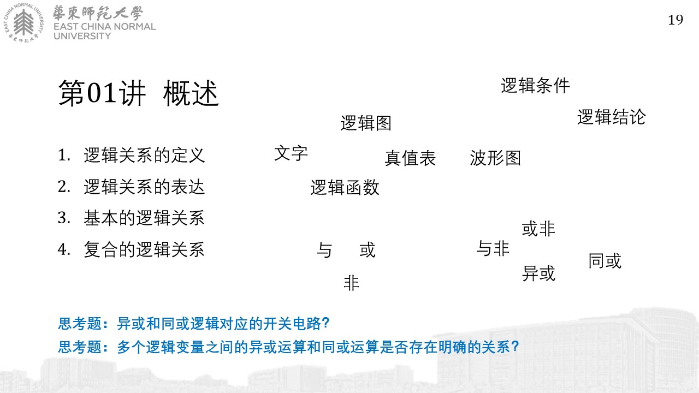

current version

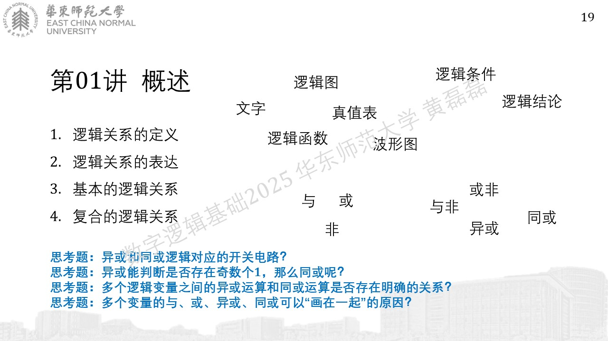
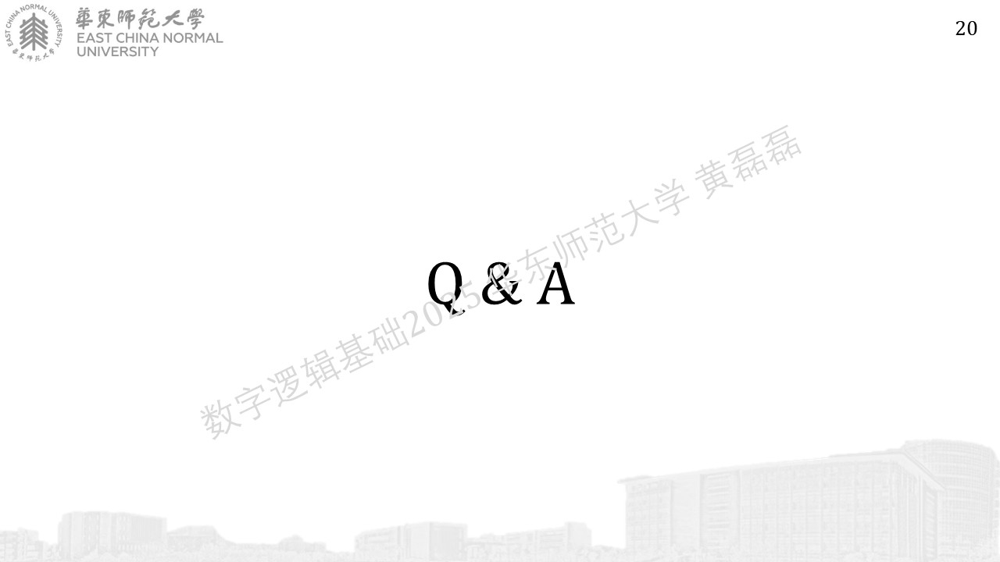
