.. -----------------------------------------------------------------------------
   ..
   ..  Filename       : index.rst
   ..  Author         : Huang Leilei
   ..  Status         : phase 000
   ..  Created        : 2024-09-10
   ..  Description    : description about 第02讲 - 逻辑代数- 基本定理
   ..
.. -----------------------------------------------------------------------------

第02讲 - 逻辑代数 - 基本定理
--------------------------------------------------------------------------------

基本公式
........................................

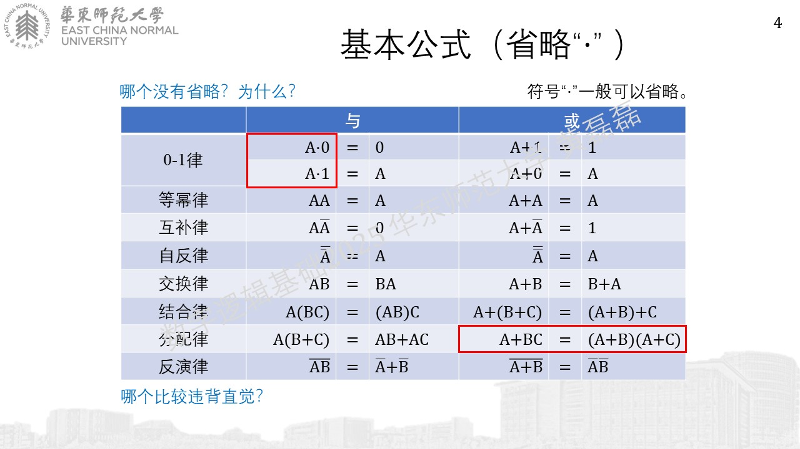
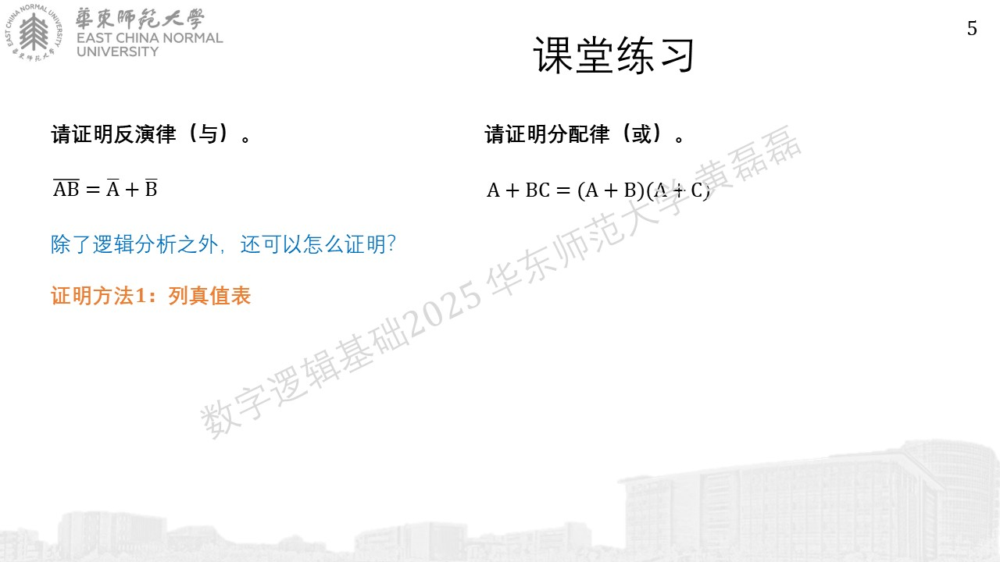

常用等式
........................................
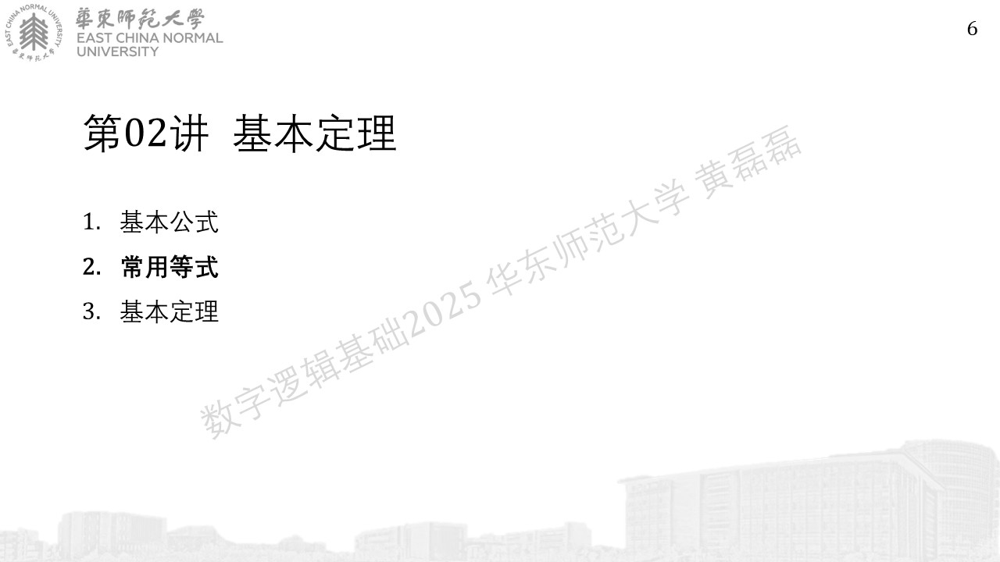
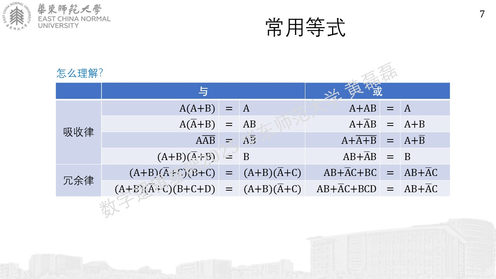
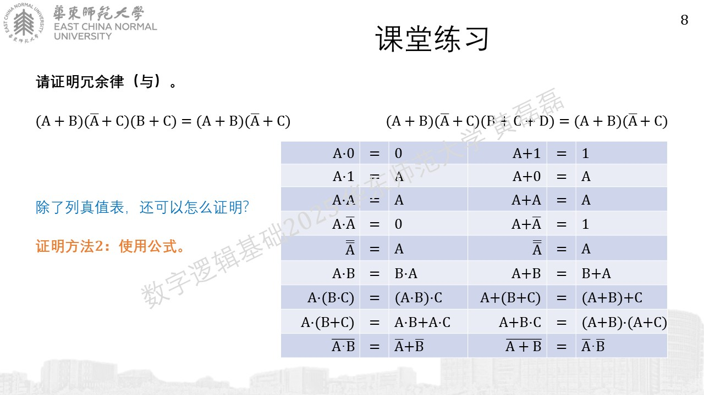

基本定理
........................................

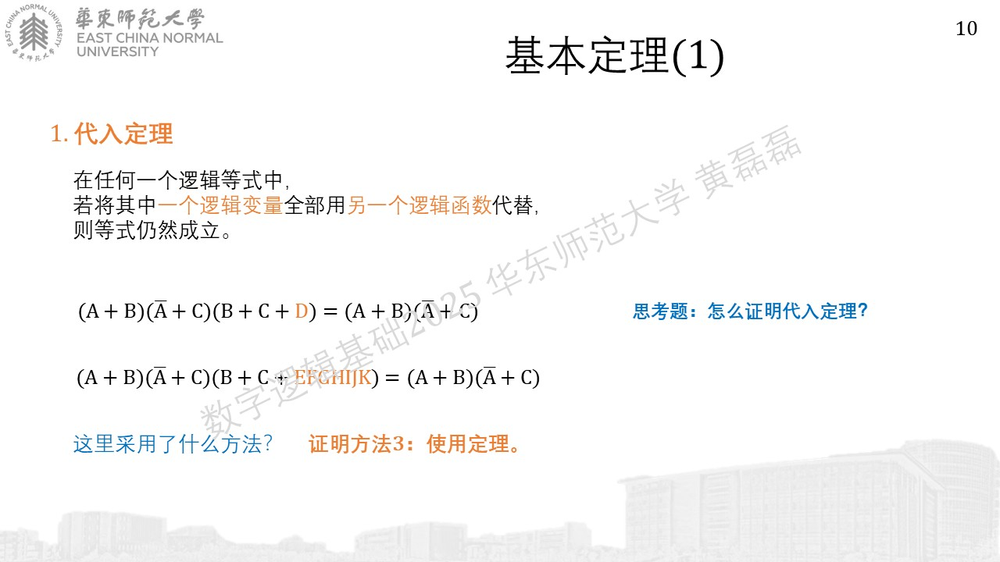

学生建议：下面两张PPT讲慢点，多分析一下，具体怎么反演和对偶

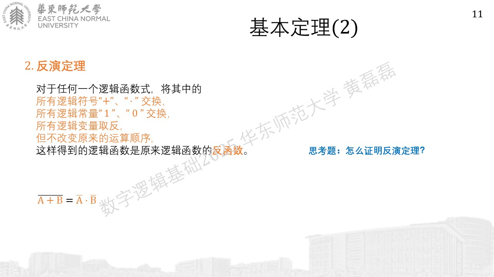
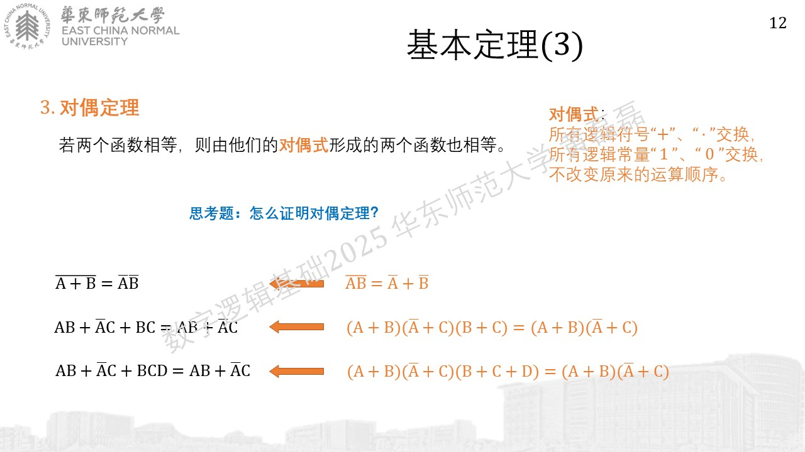
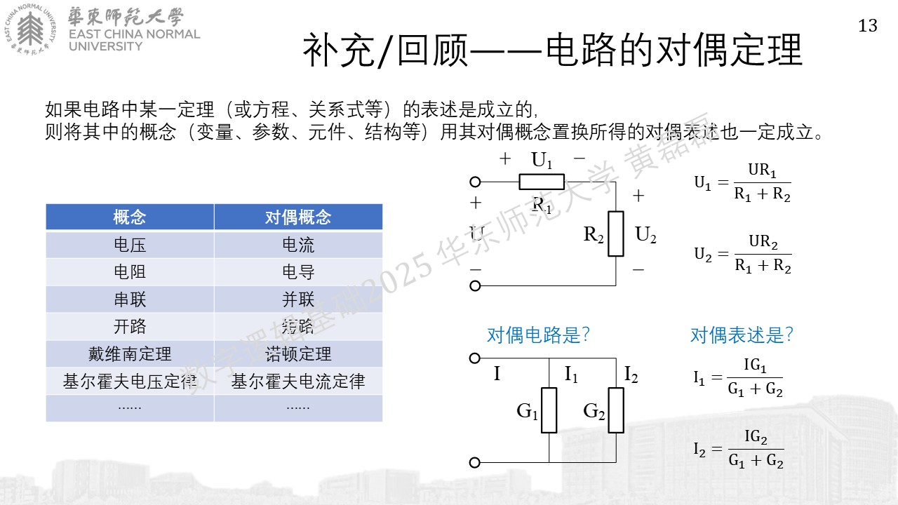

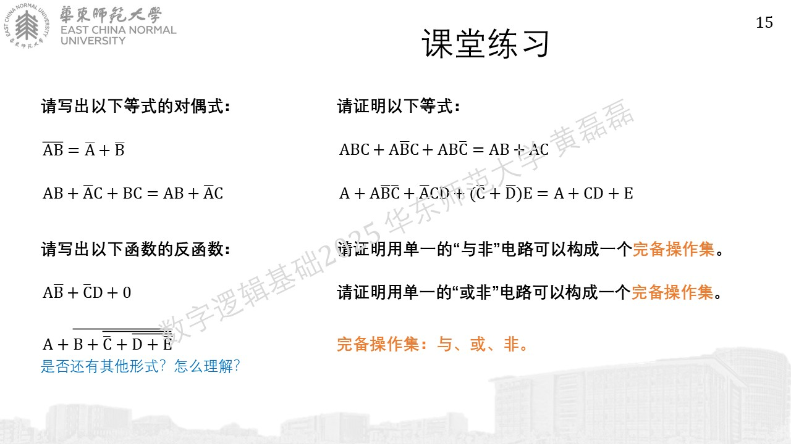

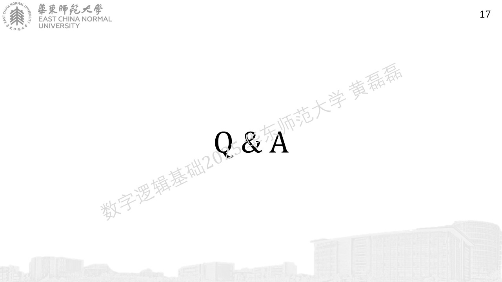
