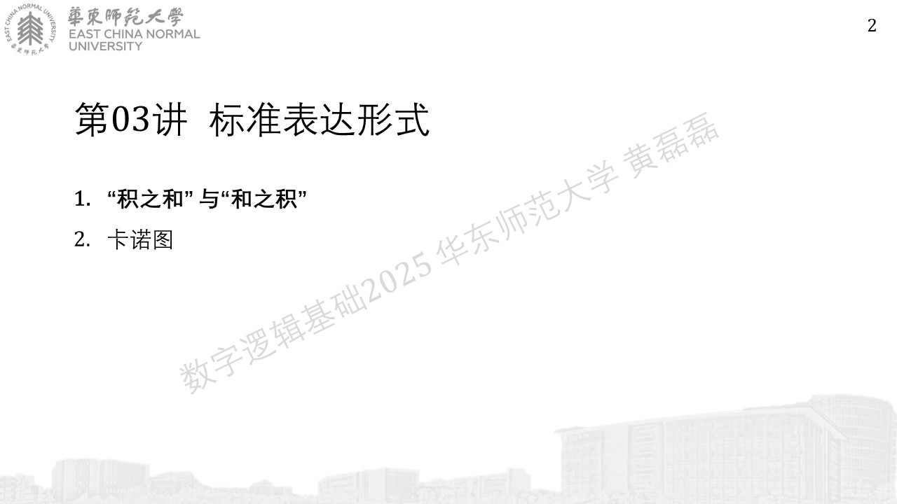
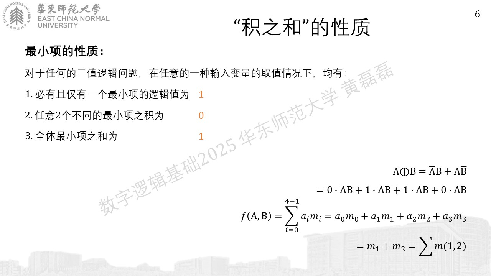
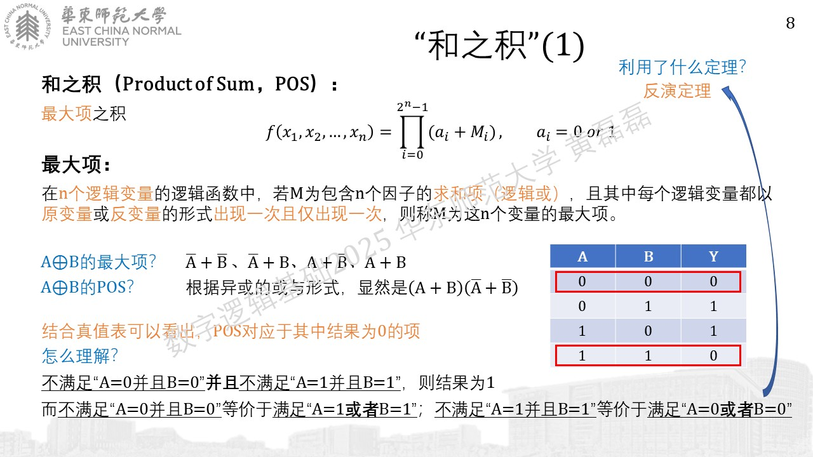
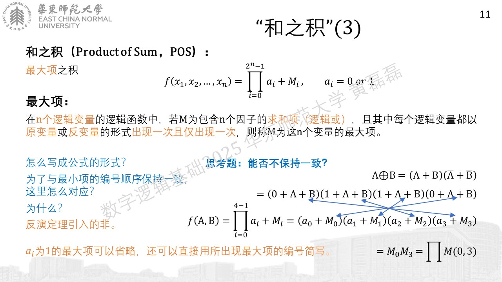
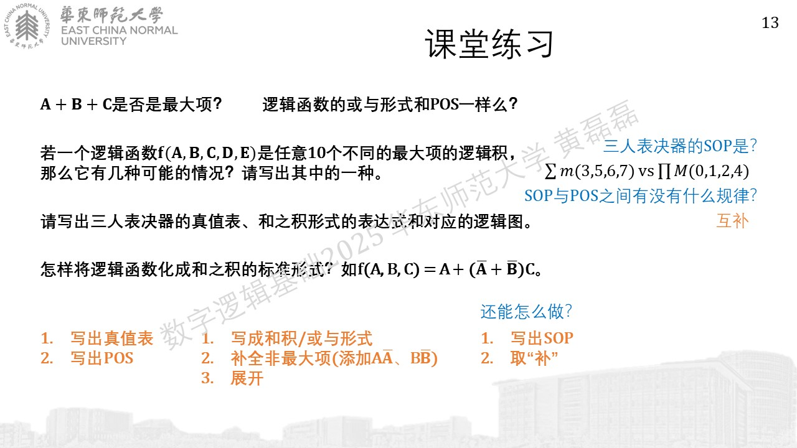
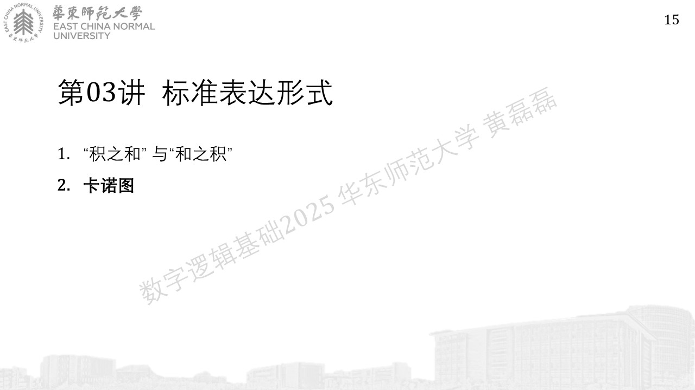
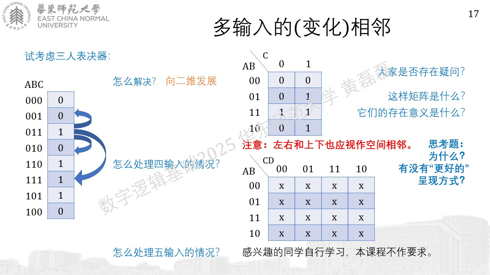
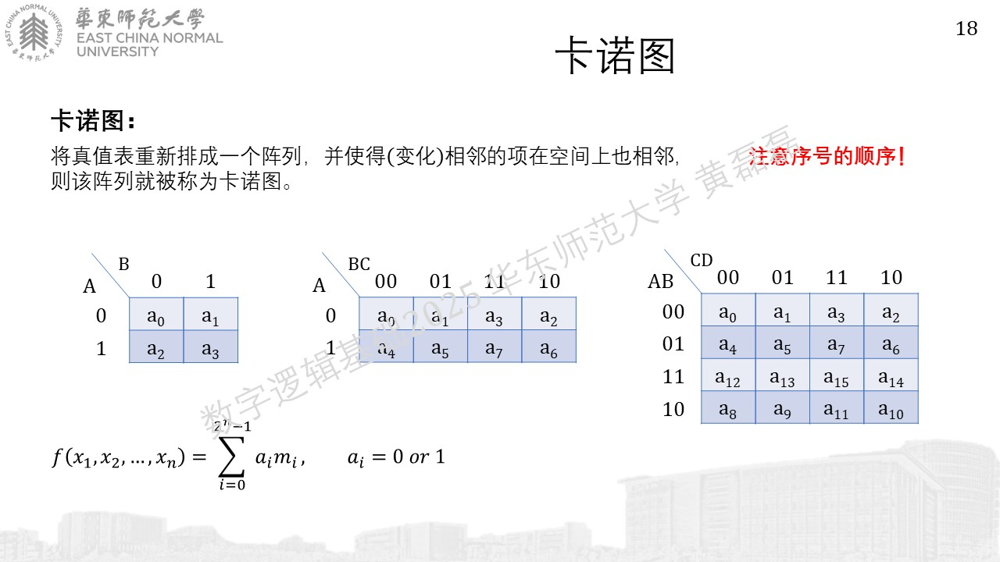
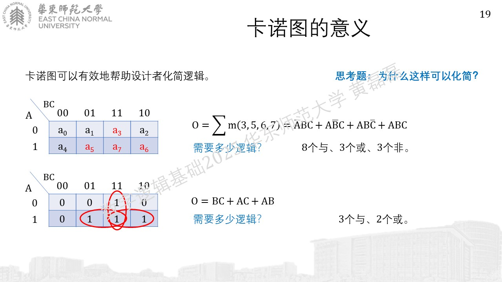

.. -----------------------------------------------------------------------------
   ..
   ..  Filename       : index.rst
   ..  Author         : Huang Leilei
   ..  Status         : phase 000
   ..  Created        : 2024-09-10
   ..  Description    : description about 第03讲 - 逻辑代数 - 标准表达式
   ..
.. -----------------------------------------------------------------------------

第03讲 - 逻辑代数 - 标准表达式
--------------------------------------------------------------------------------

.. image:: 幻灯片1.JPG

“积之和”与“和之积”
........................................

.. image:: 幻灯片3.JPG

学生建议：下一张PPT讲慢点，并解释A反B反怎么对应到0，A反B怎么对应到1：将AB看作是一个二进制数，00->0，01->1，10->2，11->3

.. image:: 幻灯片4.JPG
.. image:: 幻灯片5.JPG

.. image:: 幻灯片7.JPG

.. image:: 幻灯片9.JPG
.. image:: 幻灯片10.JPG

卡诺图
........................................

.. image:: 幻灯片12.JPG

.. image:: 幻灯片14.JPG

.. image:: 幻灯片16.JPG

