.. -----------------------------------------------------------------------------
   ..
   ..  Filename       : index.rst
   ..  Author         : Huang Leilei
   ..  Status         : phase 000
   ..  Created        : 2025-09-16
   ..  Description    : description about 第04讲 - 逻辑代数 - 逻辑化简
   ..
.. -----------------------------------------------------------------------------

第05讲 - 组合逻辑 - 电路的分析
--------------------------------------------------------------------------------

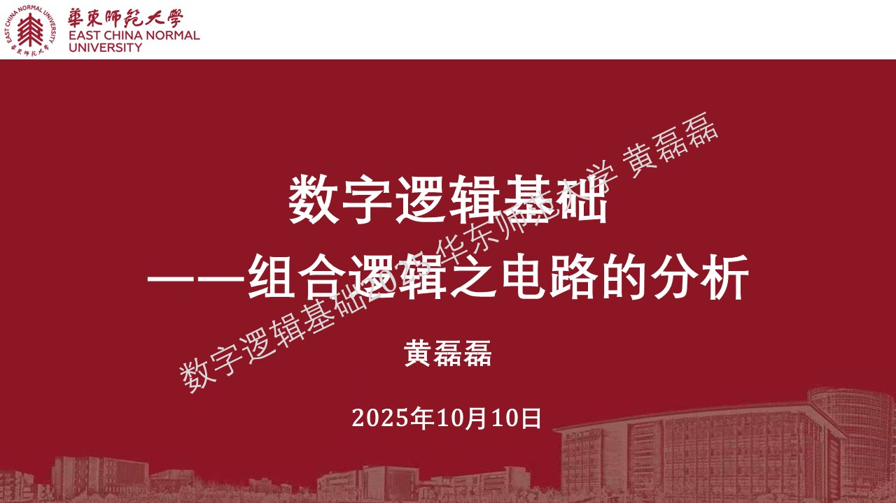

分析的一般过程
........................................

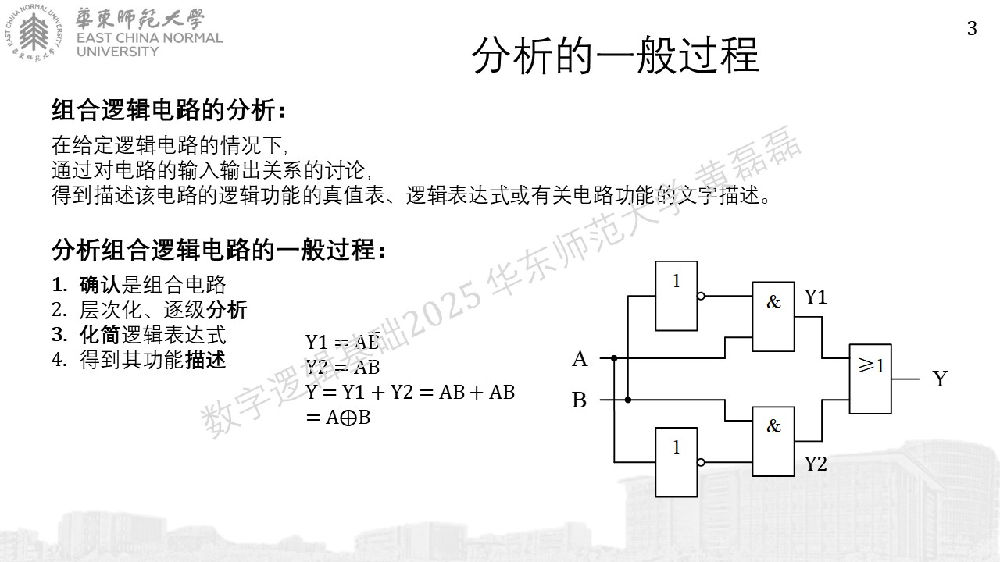
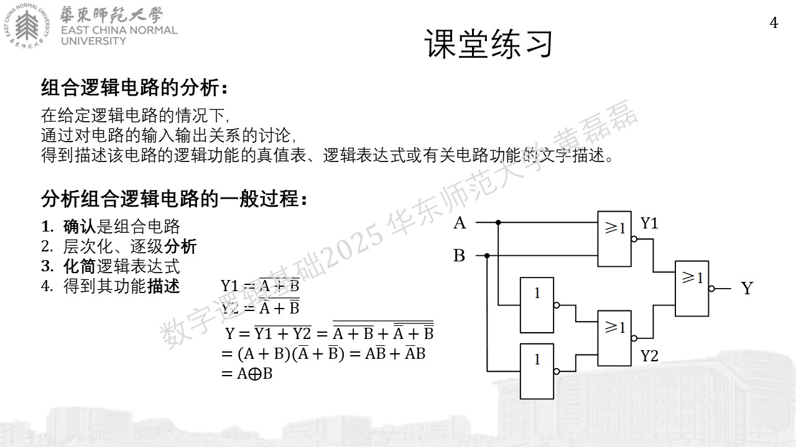
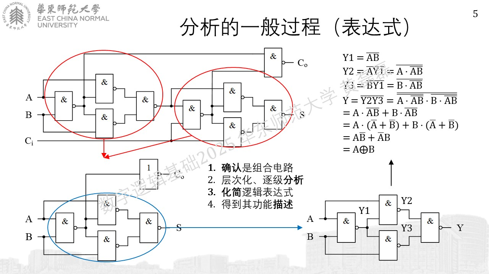
.. image:: 幻灯片6.JPG


常见电路的分析
........................................

译码器
````````````````````````````````````````
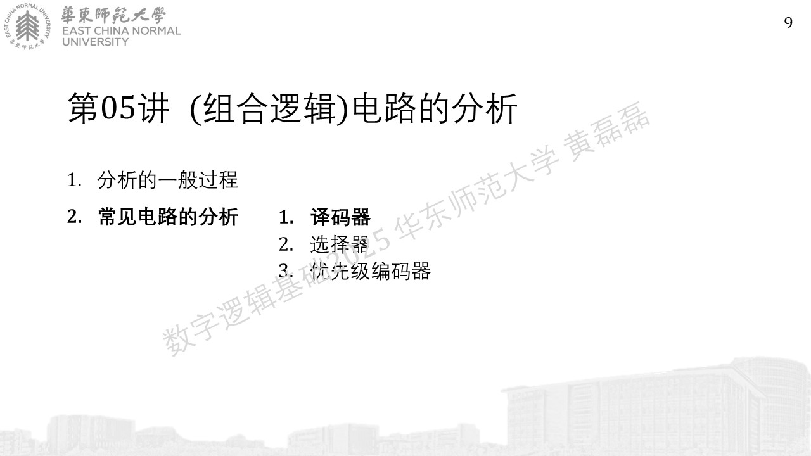
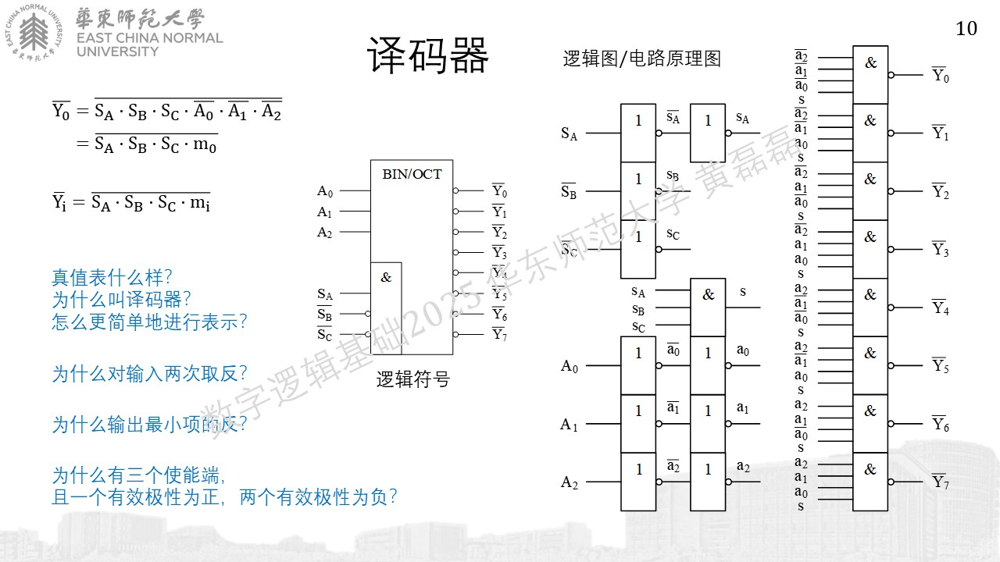
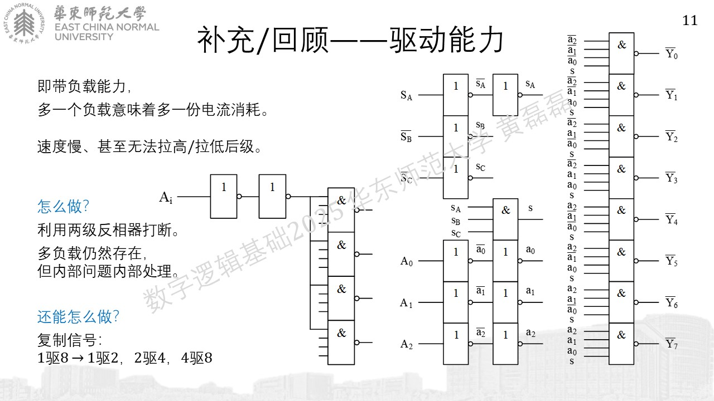

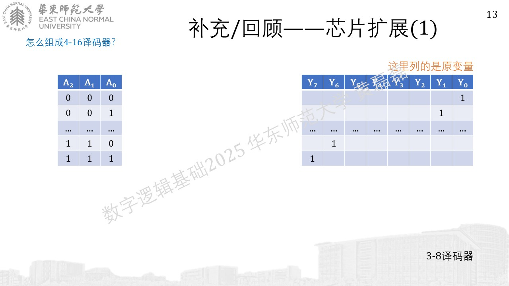
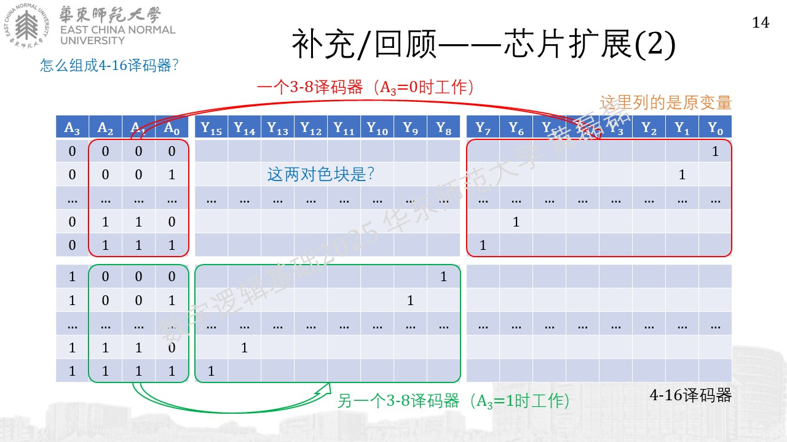


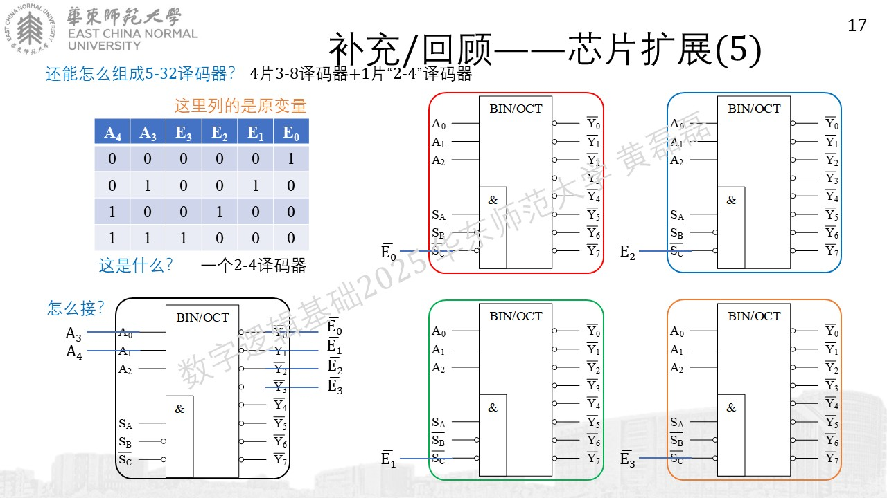
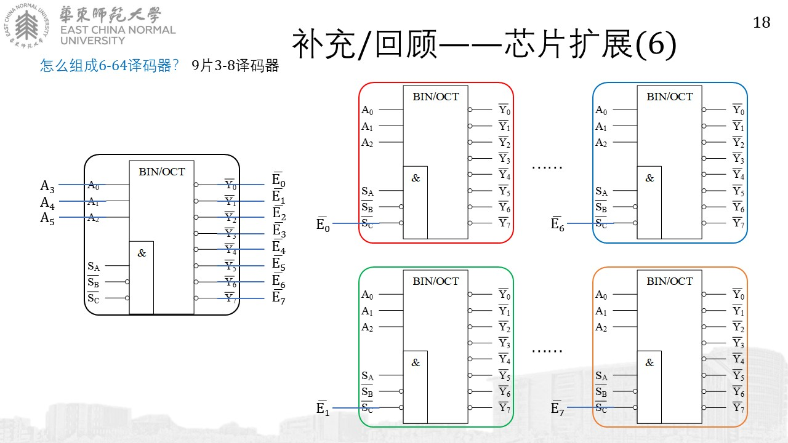

未完待续...
