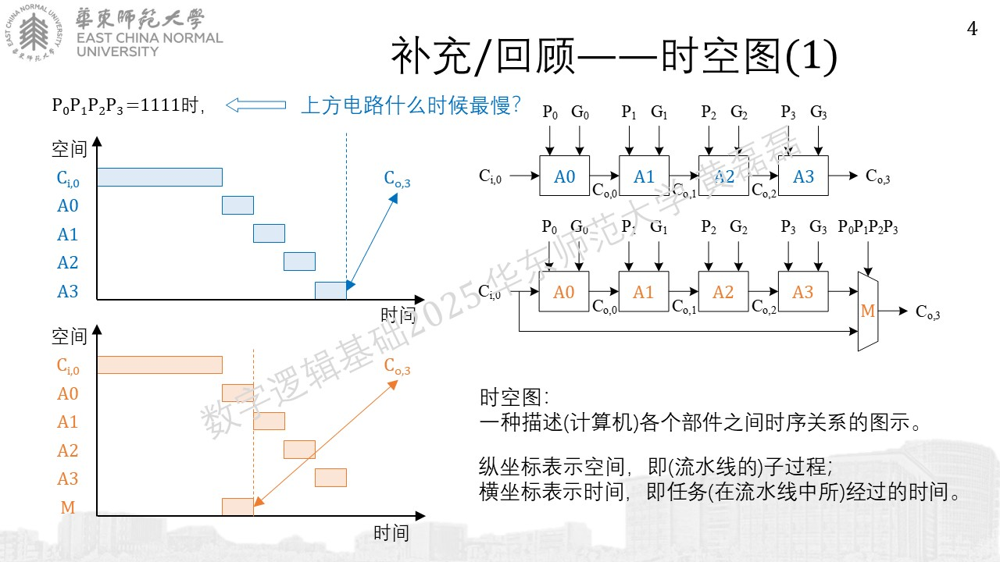
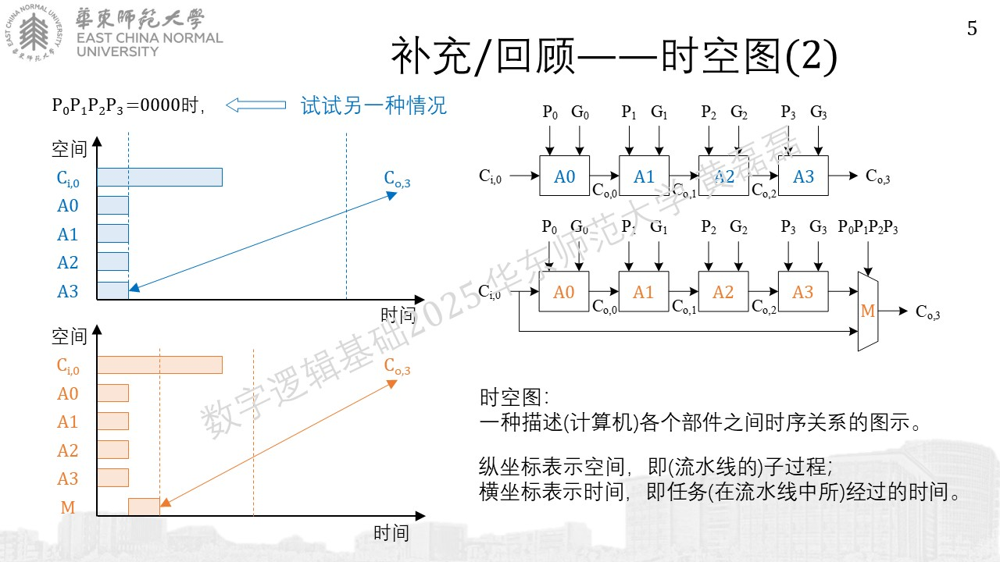
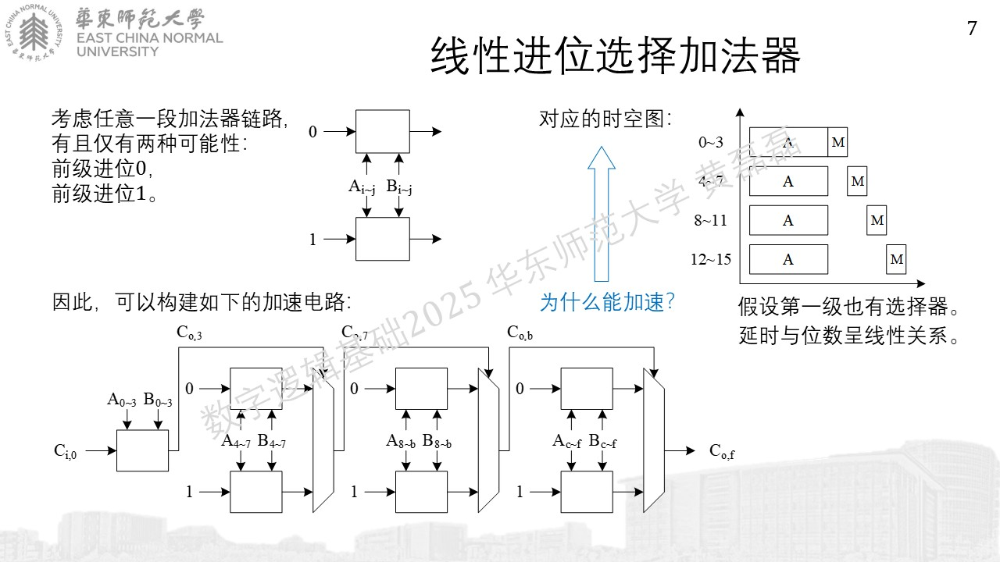
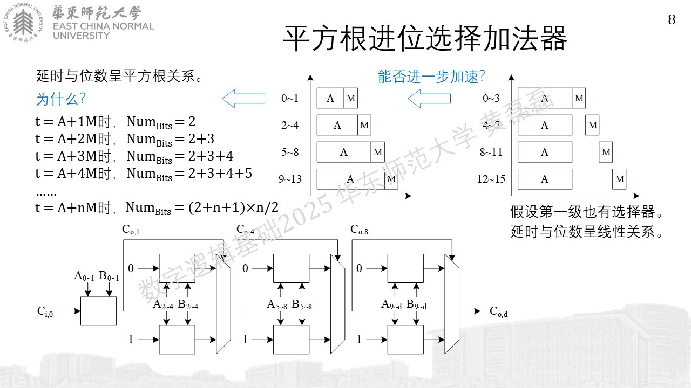
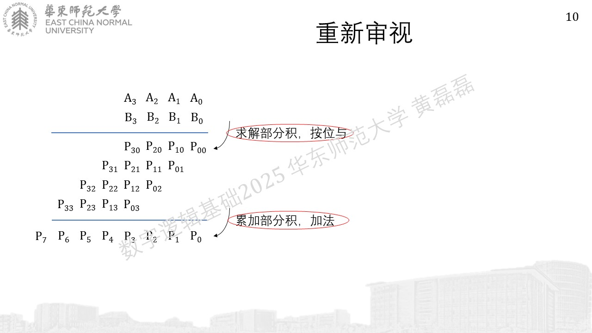
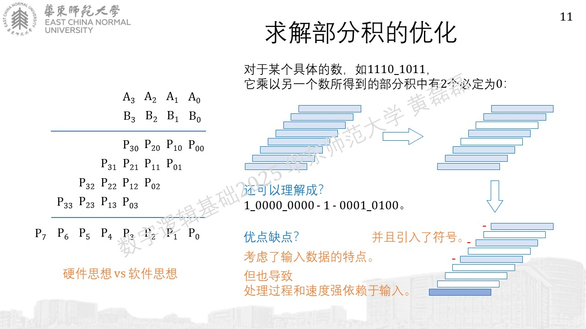
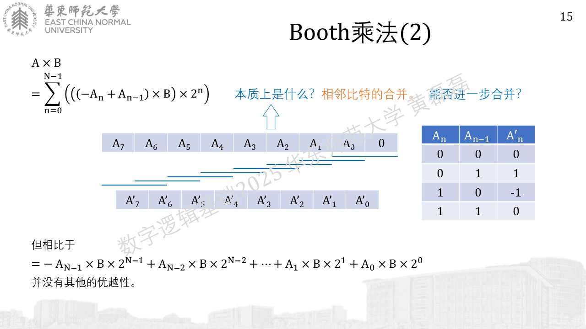
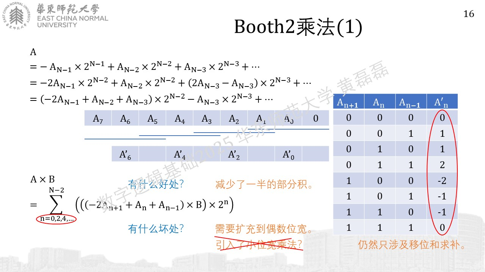
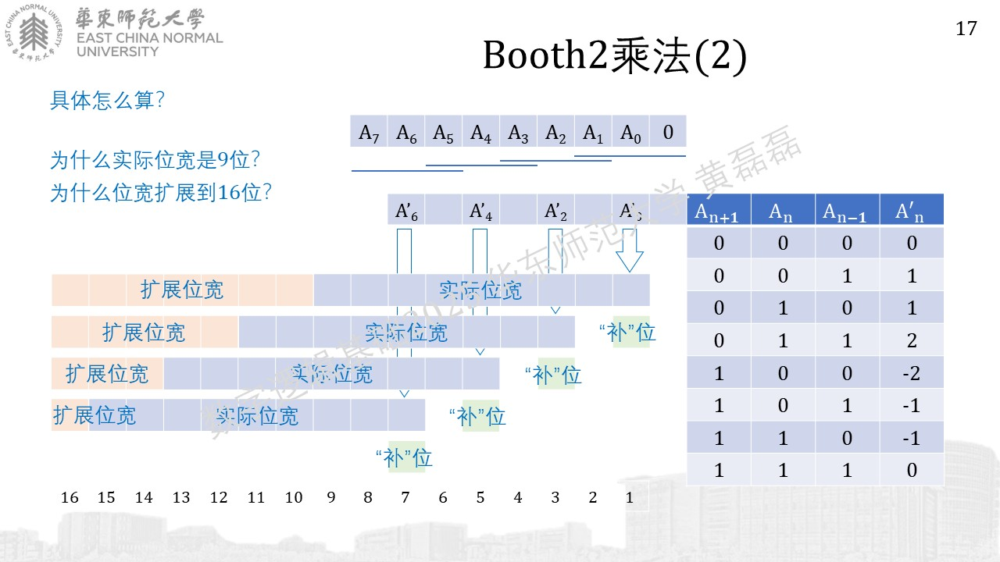

.. -----------------------------------------------------------------------------
   ..
   ..  Filename       : index.rst
   ..  Author         : Huang Leilei
   ..  Status         : phase 000
   ..  Created        : 2025-09-16
   ..  Description    : description about 补充C.1 - 其他加法器和乘法器
   ..
.. -----------------------------------------------------------------------------

*补充C - 其他加法器和乘法器*
--------------------------------------------------------------------------------


*加（补充部分）*
........................................
.. image:: 幻灯片2.JPG






**previous version:**


**current version:**



*乘（补充部分）*
........................................



**previous version:**


**current version:**






**previous version:**


**current version:**





*booth2*
````````````````````````````````````````

.. toctree::
   :maxdepth: 2

   ../数字逻辑基础 - 第06讲~第07讲 - 补充C.2 - Booth乘法器/index

..
   .. image:: 幻灯片19.JPG
   .. image:: 幻灯片20.JPG
   .. image:: 幻灯片21.JPG
   .. image:: 幻灯片22.JPG
   .. image:: 幻灯片23.JPG
