.. -----------------------------------------------------------------------------
   ..
   ..  Filename       : index.rst
   ..  Author         : Huang Leilei
   ..  Status         : phase 000
   ..  Created        : 2024-09-10
   ..  Description    : description about 第15讲~第16讲 - 补充E.3 - Verilog语言的可综合建模
   ..
.. -----------------------------------------------------------------------------

第15讲~第16讲 - 补充E.3 - Verilog语言的可综合建模
--------------------------------------------------------------------------------

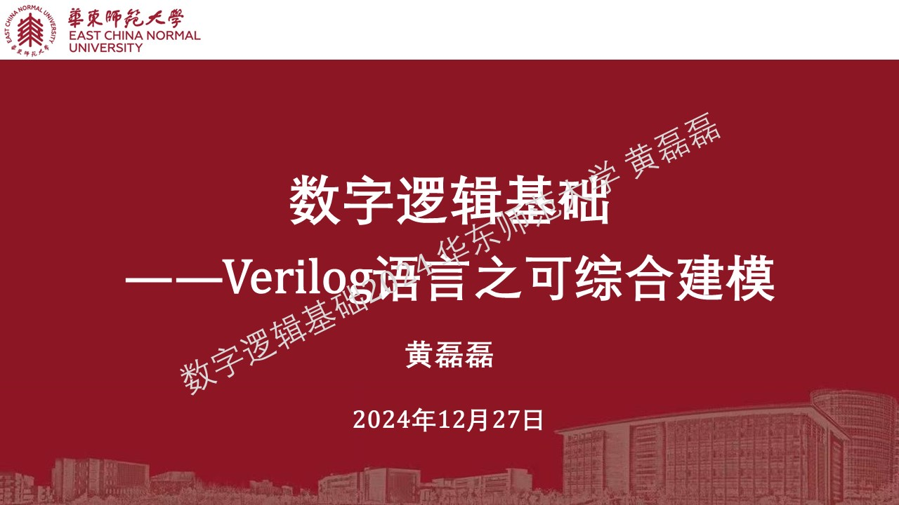
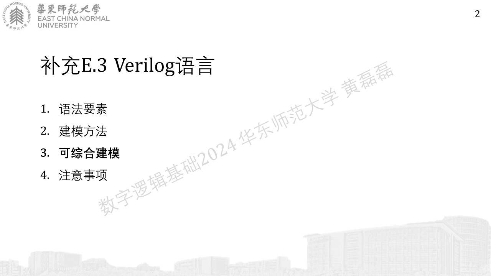
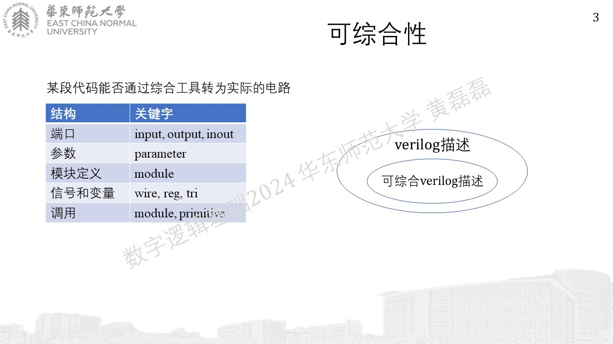
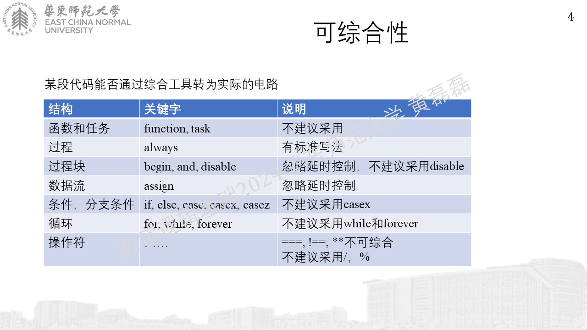
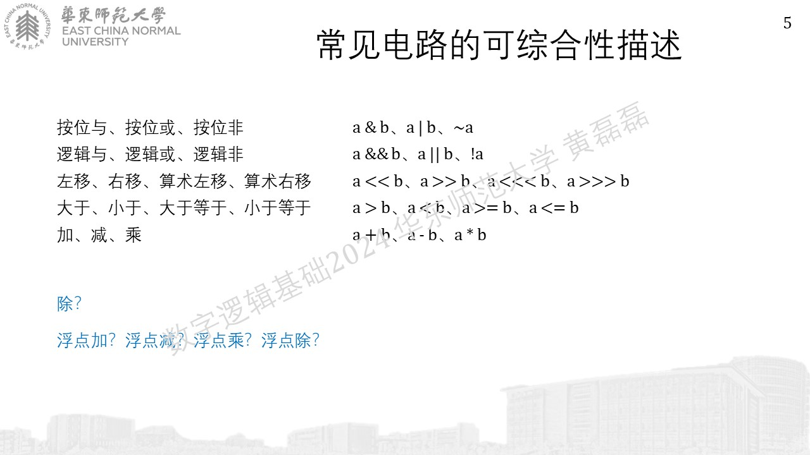
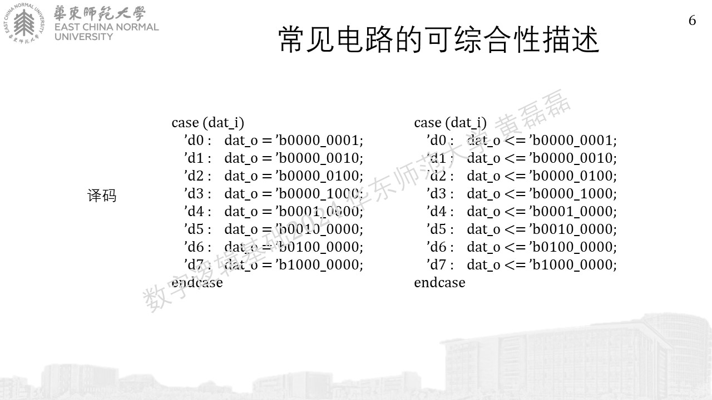
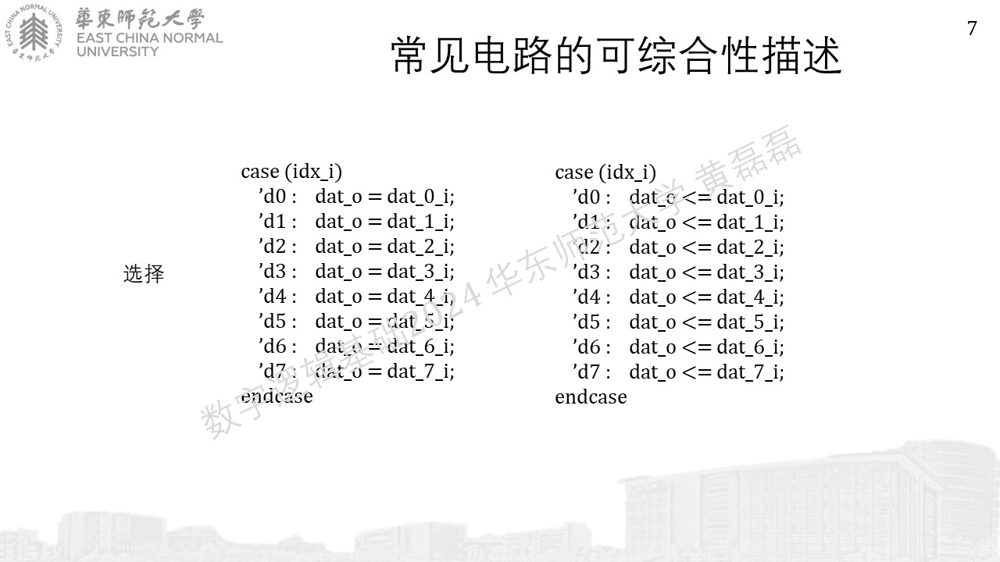
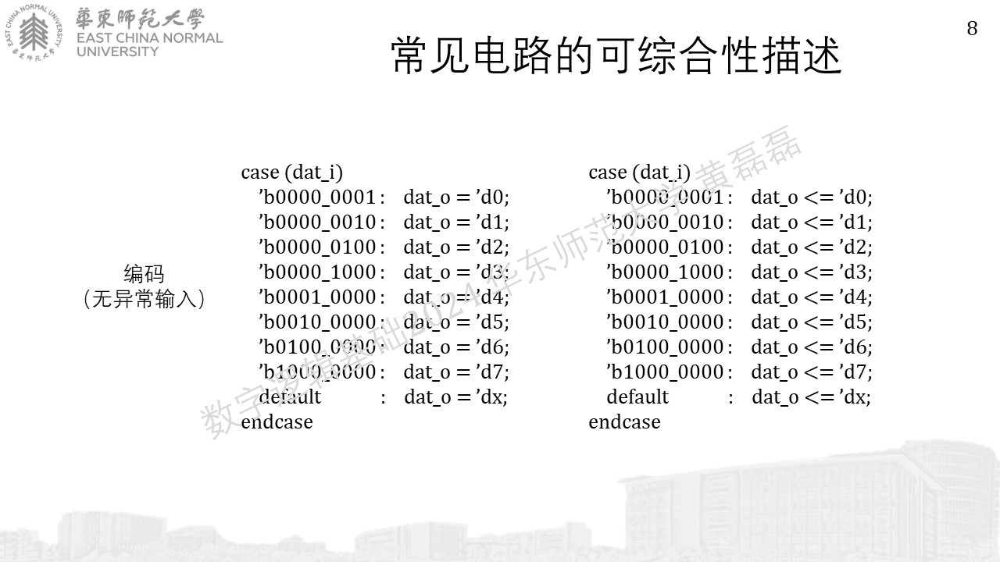
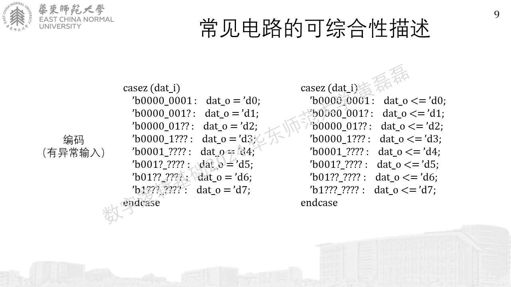
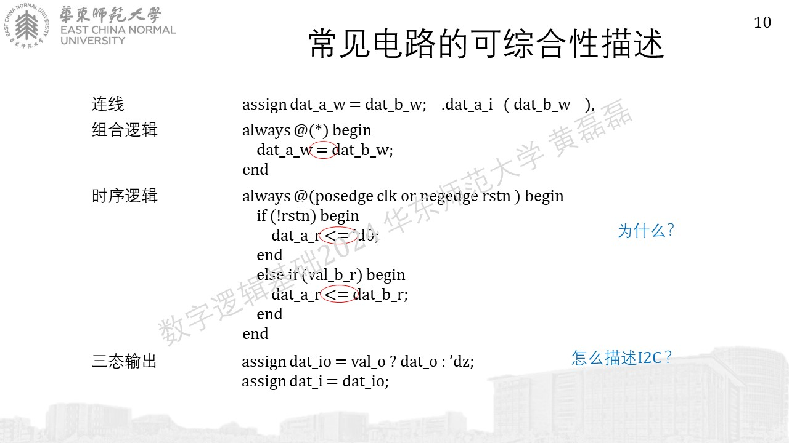
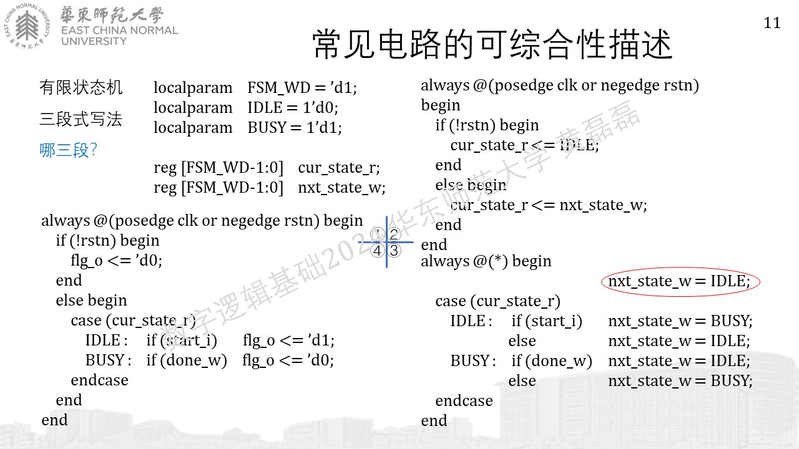
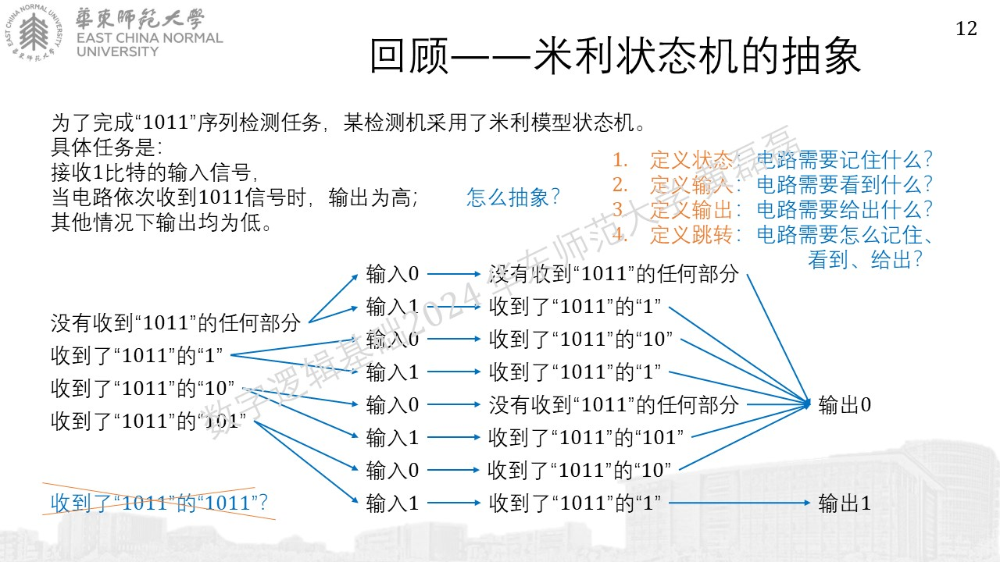
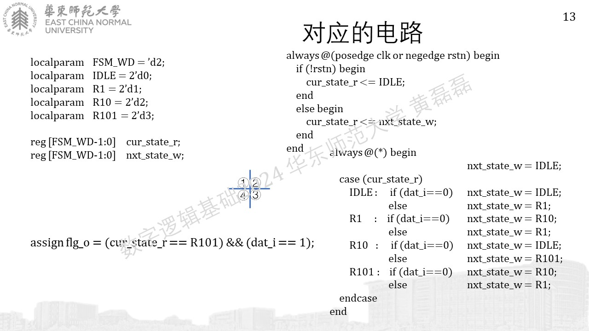
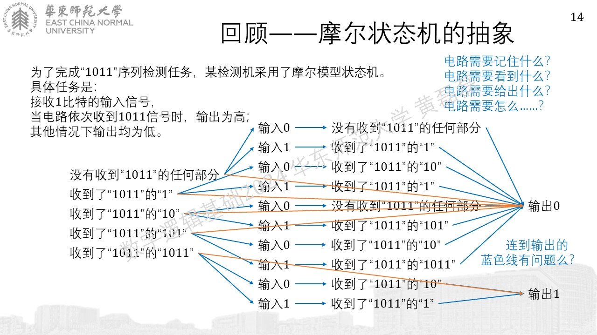
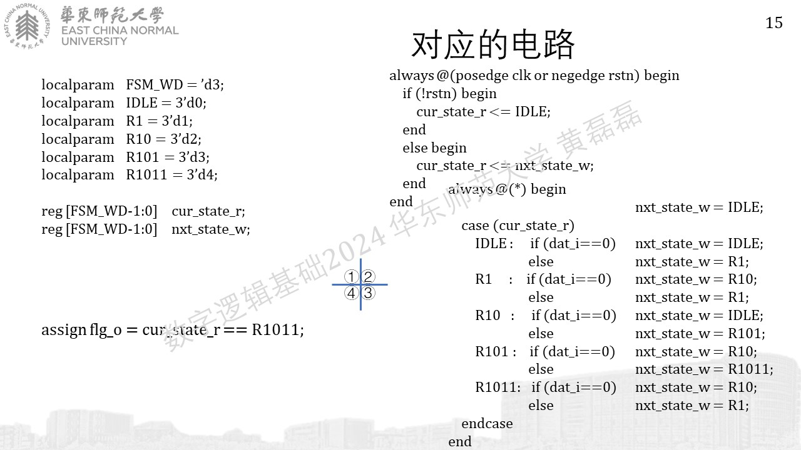
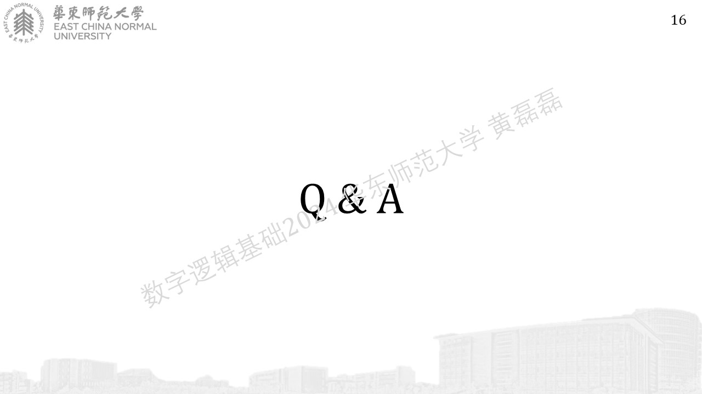
